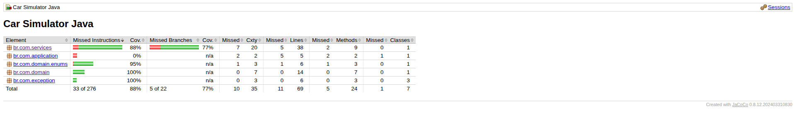

# Car Simulator 🚗💨

**Simulador de controle de carro com máquina de estados e regras realistas em Java.**

Projeto de estudo focado em modelar comportamento complexo, aplicar boas práticas de orientação a objetos e construir uma base sólida para projetos Java backend.

### Objetivo do Projeto

Praticar conceitos avançados de Java de forma progressiva:

- Modelagem de **máquina de estados** (state machine)
- Validações interdependentes entre atributos (velocidade, marcha, ligado)
- Separação de responsabilidades (SOLID)
- Injeção de dependências manual
- Tratamento de erros com exceções personalizadas
- Logging profissional com SLF4J
- Gerenciamento de build com **Maven**
- **Testes unitários** com JUnit 5
- Cobertura de testes com **JaCoCo**
- CI com GitHub Actions

### Regras do Simulador (conforme o exercício)

- Carro inicia **desligado**, em **ponto morto** (marcha 0) e velocidade **0 km/h**
- Carro desligado **não executa nenhuma ação**
- Acelerar/desacelerar altera velocidade em **1 km/h** por chamada
- Velocidade máxima: **120 km/h**, mínima: **0 km/h**
- 6 marchas + ponto morto
- Velocidade limitada por marcha:
  - Marcha 0 (ponto morto): 0 km/h
  - 1ª: 0–20 km/h
  - 2ª: 21–40 km/h
  - 3ª: 41–60 km/h
  - 4ª: 61–80 km/h
  - 5ª: 81–100 km/h
  - 6ª: 101–120 km/h
- Não é permitido pular marchas
- Só pode virar esquerda/direita entre **1 e 40 km/h**
- Só pode desligar em ponto morto e velocidade 0

### Arquitetura do Projeto (Clean Architecture)

```
src/main/java/br/com/zpx/car/
├── domain/          → Entidade Car (estado puro)
├── config/          → Constantes do simulador
├── exception/       → Exceções personalizadas
├── service/         → Interface + Implementação (lógica + logging)
└── presentation/    → DemoConsole (exemplo de uso manual)
```

### Tecnologias e Boas Práticas

- **Java 17**
- **Maven** (build e dependências)
- **SLF4J + simple** (logging com níveis INFO/WARN/ERROR)
- **JUnit 5** (testes unitários)
- **JaCoCo** (cobertura de testes)
- Injeção de dependências manual
- Programação para interfaces
- Exceções personalizadas
- Constantes centralizadas

### Cobertura de Testes (JaCoCo)



> Gerado com `mvn clean test jacoco:report`

### Como Executar

```bash
# Rodar testes unitários
mvn clean test

# Executar demo no console
mvn exec:java -Dexec.mainClass="br.com.zpx.car.presentation.DemoConsole"
```

### Exemplo de Logs (demo console)

```
[main] INFO  br.com.zpx.car.service.CarServiceImpl - Carro ligado com sucesso!
[main] INFO  br.com.zpx.car.service.CarServiceImpl - Acelerando... Velocidade atual: 15 km/h
[main] INFO  br.com.zpx.car.service.CarServiceImpl - Trocando para 2ª marcha
[main] INFO  br.com.zpx.car.service.CarServiceImpl - Vruuum! Virando à esquerda
```

**Projeto feito com dedicação como parte da jornada de aprendizado em Java backend.**

Feedback e sugestões são bem-vindos! 🚀
